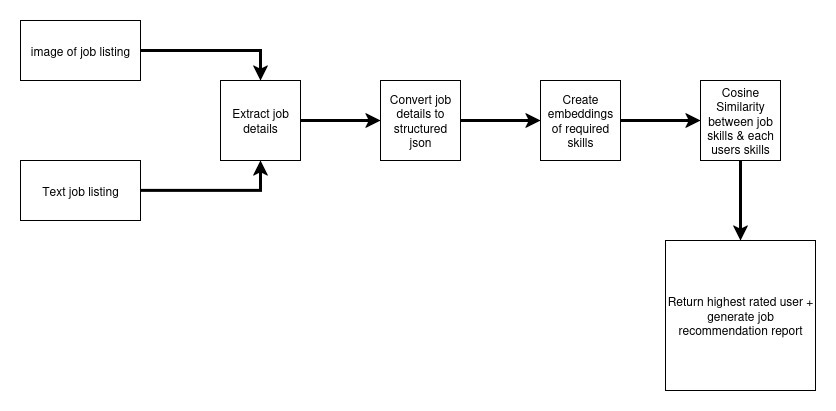

## 2. `ARCHITECTURE.md`

```markdown
# Architecture Overview



## Components

1. **User Interface**
   - Streamlit
2. **Agent Core**
   - **Executor**: Gemini used to extract structured data (json) from images of job listings or text based job listings. Sentence Transformers is used to create embeddings of the skills required for each jobs along with the skills of each user. Cosine Similarity is used to do a comparison. The best matching user is returned & Gemini is used to generate a report.
   - **Memory**: In memory vector store of job skill embeddings
3. **Tools / APIs**
   - E.g., Google Gemini API

